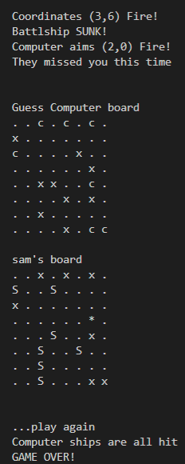
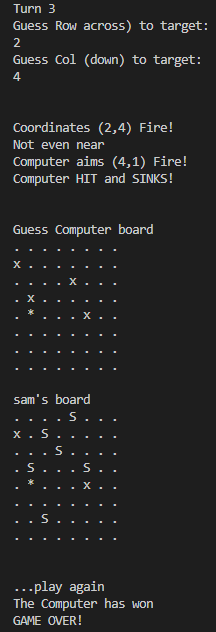

# BATTLESHIPS

# OVERVIEW
Battleships game is played on grids which each player's fleet of battleships are marked. The locations of the fleets are concealed from the other player. Players take turns plotting shots at the other player's ships. The objective of the game being to destroy the opposing player's fleet. This is a computer version of the original board game, based in a mock terminal deployed via Heroku.

* [Here is a link to the final deployment of the project HEROKU.](https://nsmith-battleship.herokuapp.com/)
## FINAL DESIGN

#  
## Table of Contents

- [BATTLESHIPS](#battleships)
  - [OVERVIEW](#overview)
  - [FINAL DESIGN](#final-design)
- 
  - [TABLE OF CONTENTS](#table-ofcontents)
  - [HOW TO PLAY](#how-to-play)
  - [FEATURES](#features)
  - [DESIGN](#design)
- [TESTING](#testing)
- [TECHNOLOGIES USED](#technologies-used)
- [DEPLOYMENT](#deployment)
- [CREDITS AND REFERENCES](#credits-and-references)
  - [REFERENCE MATERIAL](#reference-material)
- [ACKNOWLEDGEMENTS:](#acknowledgements)

#
# HOW TO PLAY

The game is based on the classic original that you can read about more on [Wikipedia](https://en.wikipedia.org/wiki/Battleship) A player will take turns with the computer to finds each others ships on the board and sink them.  The winner is the first to sink all theor opponents battleships.

## The Strategy Plane
Battleships is intended to be a light hearted game for an individual to play for a short period of time. 

Site Goals
- To provide users with a fun and simple game to play.
- To provide users with rules on how to play the game.
- To update the user wiith their progress throughout the game.

User Stories
- As a user I want a fun and simple game to play
- As a user, I want a clear understanding of the game rules and how to win.
- As a user, I want to be notified if I have won or lost the game.

# FEATURES

## The Scope Plane

Features planned:
* Random generation of ships and boards
* Play against the computer
* User inputs data
* Game maintains the score
* Input is validated for referencing outside of the grid, entering numbers, duplication
* Random generation of ships and boards

## The Structure Plane

User Story:
`As a user, I want a fun and simple game to play.`

Acceptance Criteria:
* It should be clear how to play the game.

User Story:
`As a user, I want to know what the score is.`

Acceptance Criteria: 
* It should be clear what both the player score and computer score is. This will let the user know if they are winning or not.

Implementation:
* There will be a count of turns that will display how many turns have been played. 

User Story:
`As a user, I want to know who won.`

Acceptance Criteria:
* It should clear who has won the overall game or if the game is over as amonut of turns has bee reached.

Implementation:
* There will be a modal that will appear on the screen that will display who has won and what the finishing scores were.

User Story:
`As a user, I want to have some atmosphere included with some music.`

Acceptance Criteria:
* It should clear that a user can play in the terminal

Implementation:
* A terminal screen will be viewable on the website

# DESIGN

## The Surface Plane

* Design:
The requirement was to have a terminal play the battleship game.

* Features:

How to Play - the rules are set out for the user before they begin to play.

Game starts - the game asks for the players name and then the game starts.

The User having read the instructions can then play on the game terminal and make their choice of grid references to play against the computer.

A check is done that the input are two numbers and if an entry is made twice it will not be counted and a message will advise the player.

A display shows the current turn the player until the total amount of turns has been played.

A notification will let the player know if there has been a hit or miss and a overall message if the player or computer wins or loses the game. The program can be run again so that the game is ready for another play.

## Future Enhancements

* Leaderboard - It would be nice for a player to enter their name and that their scores against the computer could be recorded onto a Leaderboard.

* Increase the size of ship more than 1

* Improve the visual of the site and add a background image or svg for added colour.

* It would be nice to add audio for sounds of hits or misses.

# TESTING

# Validator Testing

Duplicate

Error logic

* Notable Bugs
There were a few bugs in this program I went through them using GitPod and PEP8. once I worked through the issues that were identified in GitPod I checked for errors in PEP8 and I noticed that there are some erros that showed up in GitPod that did not in PEP8 see examples of the working through them.

* PEP8

[PEP8](http://pep8online.com)

* GitPod

In gitpod I have 2 errors which are not shown on PEP8 one for an extenaion and one for a missing module docstring, I think this is known as the ref is for the start of the file.

`from random import randint`

[W3 reference](https://www.w3schools.com/python/ref_string_isdigit.asp) 

## TECHNOLOGIES USED

* [GIT]()
`For version control, commiting and pushing to github`
* [GitPod](gitpod.io) 
`This was used as an IDE, or the Integrated Development Area, where the HTML, CSS and JavaScript where all written in the required file types in order to display the website.` 
* [GitHub](https://github.com/)
`this was used to host the website, so it is viewable to the public.`
* [PEP8](http://pep8online.com/checkresult)
`This was used to check errors and bugs`
* [Python](https://en.wikipedia.org/wiki/Python_(programming_language))
`The game itself is written in python and held in the run.py file.`
* [Heroku](https://id.heroku.com/login)
`Heroku was used to deploy the website as python is a backend language and the game needed a terminal to display the game.`
* [Am I Responsive](http://ami.responsivedesign.is/)
`Used to test responsiveness of the game at different screen sizes`

## DEPLOYMENT

The Game was deployed using GitHub Pages with the following the steps:

1. Click on the `Settings` icon at the top of page in the navigation bar
2. Scroll down until you see `Github Pages`
3. There will be a message box saying "Check it out here" Click on the link to take you to the next page
4. Here you will be greated with a form, Choose the repository `Battleships`
5. Choose the branch in the drop down box, in this case `MAIN`
6. Choose the directory in the next drop down box, in this case `Root` select the master branch
7. Then click `Save`
8. It takes a few seconds for the game to publish, once live, the box at the top of the page with the site name will turn green and have a `Green` tick to the left of the link. The page is automatically refreshed with a detailed ribbon display to indicate the successful deployment.

* These commands were used for version control during project:

    * git add . - to add files before committing
    * git commit -m `example message` - to commit changes to the local repository
    * git push - to push all committed changes to the GitHub repository

The Game was deployed using Heroku with the following the steps:

1. Create an account on Heroku and Login
1. Click New
1. Create new app - and asign name
1. Select region - Europe
1. Click on create app
1. In Settings - Build Pack, add the python build pack `heroku/python` and then add the Nodejs build pack `heroku/nodejs`.
1. In Deploy tab select Git Hub deployment method
1. Confirm and searchfor the repository and click connect
1. Then choose preferred deployment type manual or automatic deploys to the branch in GitHub

## CREDITS AND REFERENCES

## Reference Material

* W3 Schools was used as a reference point for Python
* Full Stack Overflow was used as a source of reference

## Acknowledgements:

- My Mentor for encouraging me to research and the advice given for improving the site.
- Code Institute example template and for the Tutors on the course.
- My family for their support.
- Media support on W3 Schools, Stack Overflow, Blogs, and Tutorials online that helped like this [Python Battleships](https://coderspacket.com/battleship-game-in-python) .
